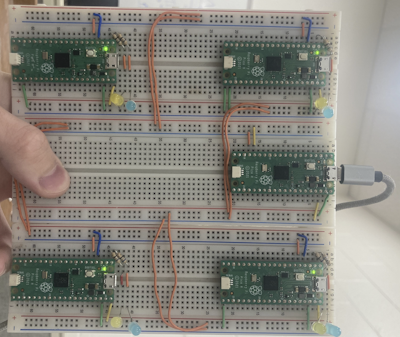

# PentaPico Cluster: A cluster computer made of Raspberry Pi Picos

A microcontroller based cluster computer for computing image convolutions.
Designed and implemented to fulfill the final project requirement for "ECE 574: Cluster Computing" at the University of Maine, Orono.
Read all about it here: [Final project report (quite rushed)](./docs/writeup/Cluster_Computing_Final_Project_Report.pdf).

## Build (hardware):

TODO (you're pretty savvy, right? Just look at pico_cluster.png and check out which GPIO pins are used for what in the code eh?)

## Build (software):
1. Install the rpi pico sdk somewhere on your computer: [pico-sdk](https://github.com/raspberrypi/pico-sdk)
2. Enter a linux environment (WSL)
3. 
        mkdir build
        cd build
        export PICO_SDK_PATH=../relative/path/to/the/cloned/directory/named/pico-sdk
        cmake ..
        make

4. Copy the `head_pico.uf2` file to the head node pico
5. Copy the `compute_pico.uf2` file to each compute pico

## Usage

1. Connect the head node to your PC with a microUSB cable.
2. Execute [./client.py](./client.py) with an image to compute a convolution over.

Use the `--help` command line argument for more in-depth usage. 
For example, [./client.py](./client.py) assumes the first available serial connection is the head node, but you can specify it with the `--port` argument.

## Docs:

Documentation related to the project is contained in [docs/](./docs/).
[docs/Journal.md](./docs/Journal.md) contains notes and thoughts that I felt like committing to memory during the development of the project.
[docs/writeup/](./docs/writeup/) contains a copy of the Overleaf project used to compile the final report.
In theory I could compile this locally but I haven't bothered to learn to do that yet.