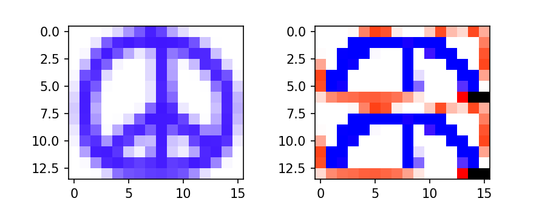
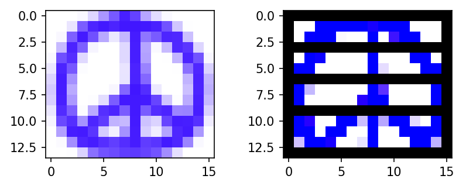
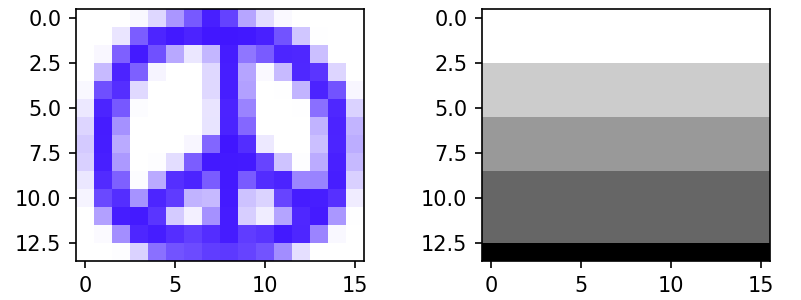

# RPi Pico Cluster Journal
Willow Cunningham

This is a journal to contain my thoughts and todos during the development process. 
Read at your own risk.

## 3/30/2025

Got head pico to at least see compute pico on i2c using the i2c_slave library.
Very cool.

Next up, I want to be able to set the address with GPIO - I need at least 4 slave address configs, so 2 GPIO... done.

Next, I want to standardize communications. 
Send data, receive data, etc.
How to do.

Hmm, honestly it might be easier to start with sending image data to the pico from serial, right. Lets do that first.

Okay, got the data sending over. Image + kernel. ez as pie! Might go to bed now...

## 4/1/2025

Copied in the convolve code from class hw to shared, and convolve on the head. 
Sending data back to client using super primitive printf %d, because bytes were being annoying.
This is also being annoying tho - often fails to send all the bytes.

Still, sometimes an image makes it back and we can imshow in the client.
Unfortunately the result is always incorrect... something to work on tomorrow, its late

## 4/3/2025

Nothing works!! Nothing!!

## 4/4/2025

More things work :)

Time to figure out why the result image isn't zero-padded on the bottom edge:

(I was using im_width where I should have used im_height).
Annoyingly, serial still regularly drops bytes when reading the output image but really what can you do? I guess have a system to request re-sends and stuff...

Okay, I think I solved it by having head node wait for ACK from client before it stops re-sending the image? Not sure tho because its magically working first try rn. 
Whatever.

Either way, this means that next up is board to board comms! Hope this isn't too hard... (it's gonna be hard)

## 4/5/2025

Did a ton of messing around with i2c master/slave on head node. 
Turns out that the rpi pico SDK integrated the i2c_slave library around 2 years ago, so using that now.
Finally figured out a scheme for communicating integers! 
Now I am going to move this testing work to the compute node codebase and get full image transfers working.
Just work off of the compute node alone send/rcv at first!

Okay, so communicating might be a bit hard.
Allocating arrays in the interrupt handler seems to not be allowed, and running the computation would obviously take too long.
Therefore, I2C needs a different protocol.
I vote:

	// commands

	// procedure (ordered)
	head								compute
	send TRANS_KIM_DIMS					set state to COMPUTE_STATE_DIMS_RD
	send 16 bytes (4 ints)				recv k dims and im dims
										set state to COMPUTE_STATE_WORKING
										allocate im and k in main loop
										set state to COMPUTE_STATE_IDLE
	wait for state to be COMPUTE_STATE_IDLE
	send TRANS_KIM						set state to COMPUTE_STATE_DATA_RD
										recv image and kernel data
										set state to COMPUTE_STATE_WORKING
										run convolve in main loop
										set state to COMPUTE_STATE_IDLE
	wait for state to be COMPUTE_STATE_IDLE

(the vote is unanimous)

I have now implemented something akin to this, can't be bothered to note any differences though. 
What is key is that we can send and recv image data etc etc there is a protocol yadda yadda yay.

Next up, make it actually convolve and start sending info from head to compute

(by the way, right now the comms functions send and wait for confirmation at once. This wont work once we start parallelizing)

Okay, having the head node control one compute node was trivial as *beep*! Let's go! (censoring the language because this is technically academic work but yayyyyy)

So, after many hours and getting more tired, here's where I'm leaving this:

## 4/6/2025

The finish line is on t he horizon. I've got things *mostly* working, just having trouble with the reassembling of the output image at the end.

So something might be going on with the indexing? but then again, probably not! Look at what the output is for colors based solely on the indices and not the results: 

These indies are perfect, so what really gives?

Well, are they perfect? Shouldn't I see everything except the first entry shifted down by one row? Huh, yeah I think I should.

(time marches on)

So, all that indexing stuff? Difficult, but also just because I'm stupid. Solution was just to read back the same number of rows at the same start indices as we send in data, but backwards so that they overwrite properly

Finally having just a small issue where it wants to write off the bottom edge.

Falke: height=204
 - nproc=4, last row=205
 - nproc=2, last row=205
 - nproc=1, last row=206?

Also writes off for peace

Not sure where this is coming from but I'm calling it here for a while. We can say that the cluster is functional I think, everything else is set dressing. Will need timing info for the writeup but that shouldn't be hard to add.

## 4/19/2025

Adding status LEDs and also timing.
We want to get memory allocation time and convolve time, so response for mem alloc and for convolve need to contain a uint64.

Having an issue right now where the result is ALWAYS read as 4.
What in the world?
Nvm, the problem was (partially) that I was returning the result of the read_blocking (aka n bytes read) (which is 4) but still that means the buf was always 0 but im not only sending zeros so... hmm.

I tried changing the idle state to 0xf0, but it is still reading only zeros.
So this is strange. It means that it isn't reading the state, but it must be reading *something*.

Well, maybe not. 
LED debugging indicates that we never reach past the image end in our response.

Ah. We don't even reach the end of the image... what on earth?

Oh, I know why.

It's because we intentionally read back (k_height/2) fewer rows.
This is also probably why everything breaks on second run?
We need to read entire result into a buffer and then only copy part of it. yea.

So that helped. 
I forget where I am tho.

Whats going on now is the im_row_counts is being *reset* to 0 in the read im data loop. what the fuck is going on man?